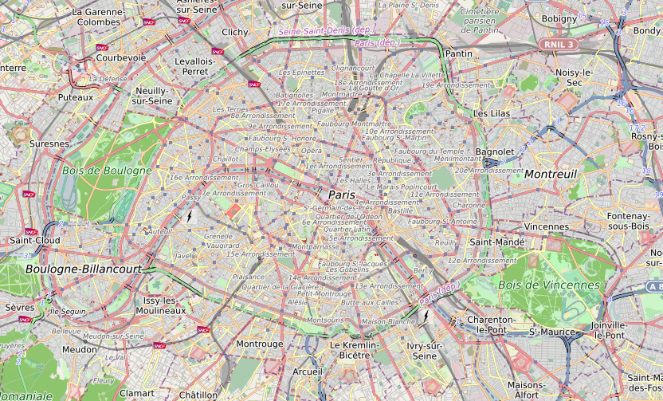
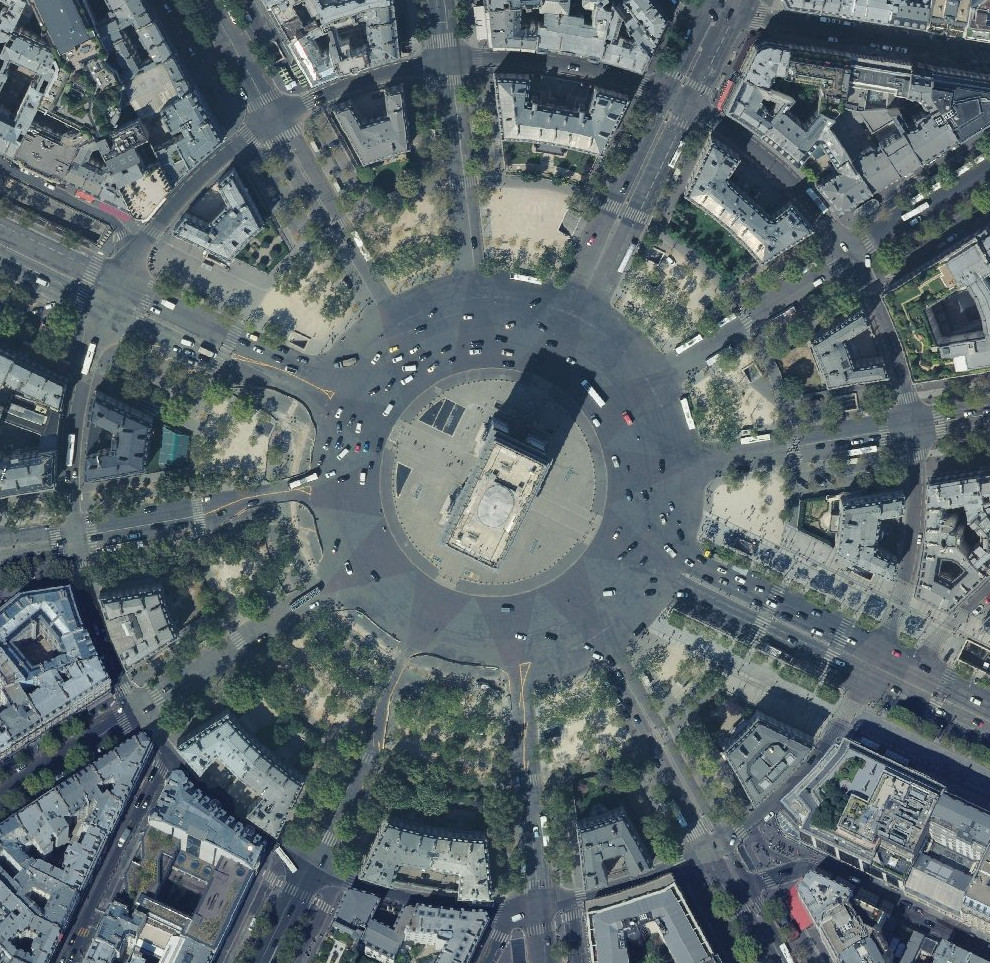
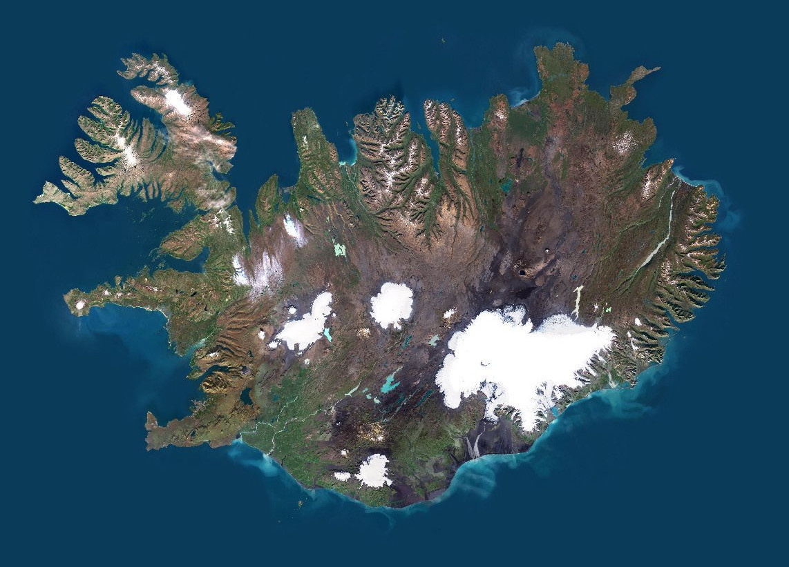
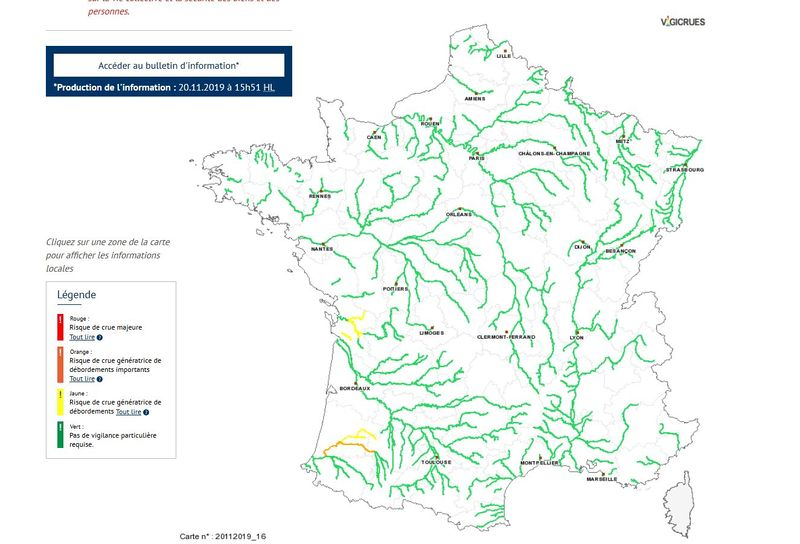
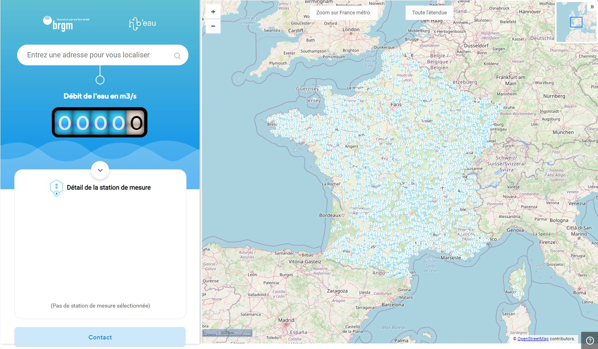
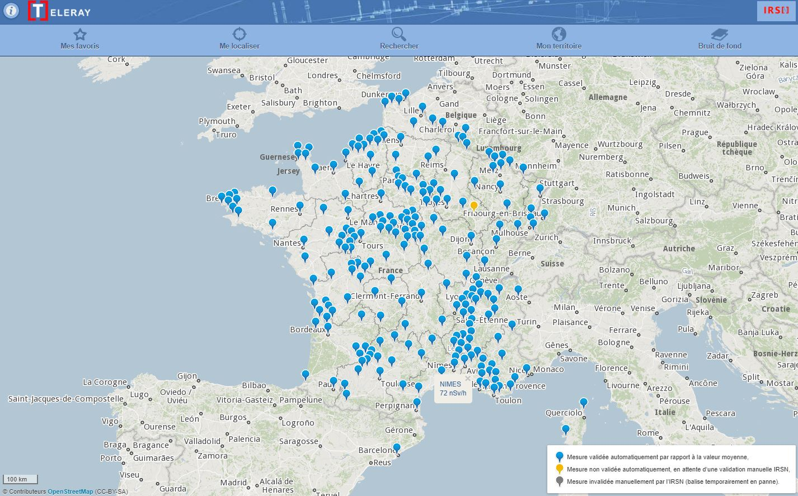
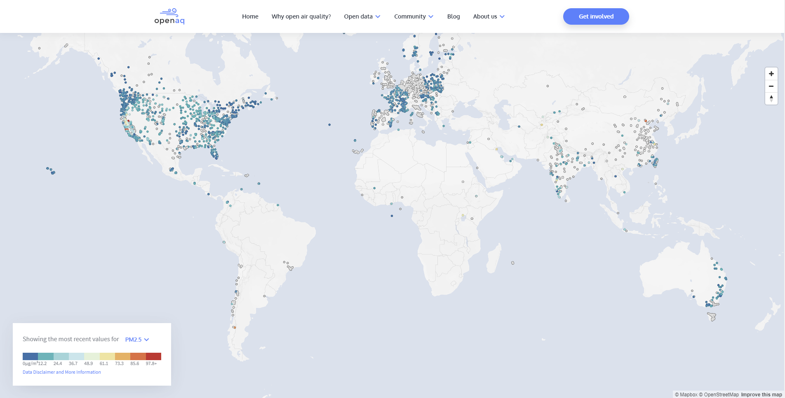
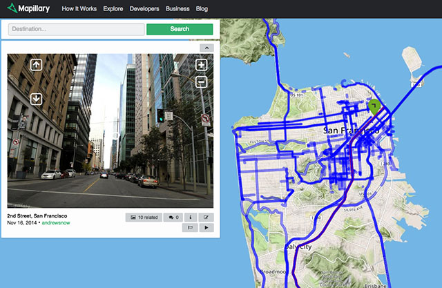
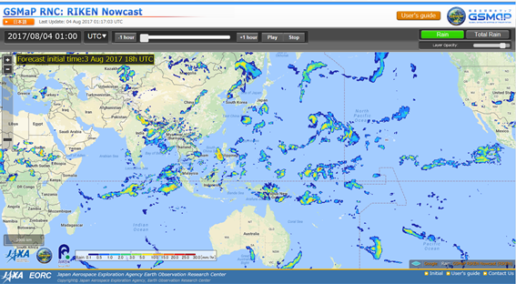
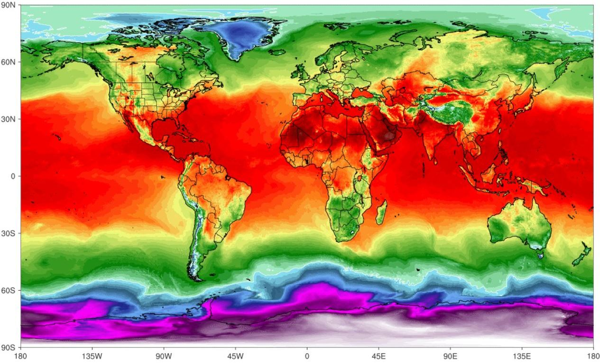

# Catalogue cartographique

Le catalogue cartographique permet de visualiser et d'interagir avec une carte numérique. Grâce aux technologies web les plus avancées, il permet le suivi de données géospatiales en temps-réel.

::: warning Note
Cette fonctionnalité requiert un abonnement spécifique, sans celui-ci vous ne pourrez y accéder.

:point_right: Vous êtes propriétaire d'une organisation ? <tour-link text="Voir comment souscrire" path="home" :params="{ organisation: 'owner', route: 'organisation-settings-activity', page: 'billing' }"/>
:::

## Concepts de base

Nous allons illustrer ici les *concepts de base* vous permettant de prendre en main la cartographie.

La carte peut contenir un **fond** (i.e. contexte géographique), un ensemble de **couches** (i.e. données métier), et possède une **extension** (i.e. la zone terrestre actuellement à l'écran), ainsi que des outils de navigation et de zoom. Une couche référence un jeu de données géospatiales et spécifie comment il est représenté (i.e. symbolisé) sur la carte. 

Une **couche d'entités** est un regroupement d'entités géographiques semblables, à savoir des bâtiments, des parcelles, des villes, des routes et des épicentres de tremblements de terre, par exemple. Les entités peuvent être ponctuelles, linéaires ou surfaciques (surfaces). Les couches d'entités sont adaptées à la visualisation des vos données métier superposées à vos fonds de carte. En utilisant le catalogue vous pouvez visualiser, sauvegarder, éditer et analyser vos propres entités et leurs propriétés. De plus, vous pouvez inclure une fenêtre contextuelle affichant des informations sur vos entités.

Le catalogue permet de gérer l'information **spatiale** de façon **temporelle** pour étudier des phénomènes géospatiaux *dépendant du temps* tels que: des objets se mouvant, l'historique des mesures prises par un capteur, les prévisions météorologiques, etc. Lorsqu'une couche affiche des données temporelles vous pouvez naviguer dans le temps à votre guise (passé, présent et futur) via une **ligne de temps**.

## Données

Le catalogue inclut un ensemble de données de base, auxquelles vous pouvez adjoindre vos propres données.

### OpenStreetMap

[OpenStreetMap](https://www.openstreetmap.org/) est un projet collaboratif de cartographie en ligne qui vise à constituer une base de données géographiques libre du monde. 

Ces données, au format [Vecteur](https://datacarpentry.org/organization-geospatial/02-intro-vector-data/index.html) sont dites structurées selon des thématiques données (bâtiments, utilisation du sol, etc.). Elles sont proposées selon différents styles de représentations (e.g. clair, sombre, topographique). Les données sont produites par [OpenMapTiles](https://openmaptiles.com/).

### BD ORTHO/ORTHO HR

Les jeux de données **BD ORTHO** (Base de Données Orthophotographique) et **ORTHO HR** (Orthophotographie Haute Résolution) sont chacun une collection de mosaïques numériques d'[orthophotographies](https://fr.wikipedia.org/wiki/Orthophotographie) en couleurs, rectifiées dans la projection légale spécifique adaptée au territoire couvert.

Ces données, au format [Raster](https://datacarpentry.org/organization-geospatial/01-intro-raster-data/index.html) sont disponibles à une résolution de 50 centimètres par pixel pour le jeu de donnée **BD ORTHO** et 20 centimètres par pixel pour le jeu de donnée **ORTHO HR**. Les données sont produites par l'[Institut national de l'information géographique et forestière (IGN)](https://www.ign.fr/) et sont placées sous license ouverte à [cette addresse](https://geoservices.ign.fr/documentation/diffusion/telechargement-donnees-libres.html).

### PlanetSAT

Le jeu de données **PlanetSAT** est une collection de mosaïques numériques d'[orthophotographies](https://fr.wikipedia.org/wiki/Orthophotographie). Les données sont issues de traitements spécifiques appliqués aux résultats des missions d'observation de la terre [Sentinel-2](https://fr.wikipedia.org/wiki/Sentinel-2) et [Landsat-8](https://fr.wikipedia.org/wiki/Landsat_8) et sont disponibles à une résolution de 10 mètres par pixel.

Les données sont produites par [PlanetObserver](https://planetobserver.com/).

### Vigicrues

**Vigicrues** est une base de données qui stocke les données de vigilance des crues fournies par le service [Vigicrues](https://www.vigicrues.gouv.fr/). Ces données regroupent l'ensemble des cours d’eau intégrés au dispositif de vigilance crues sous la forme de tronçons. Chacun de ces tronçons stocke le niveau de vigilance nécessaire pour faire face aux dangers liés aux inondations susceptibles de se produire dans les 24 heures à venir.

Le niveau de risque de chacun est représenté à l'aide du code couleur suivant :
* **Rouge**: Risque de crue majeure. Menace directe et généralisée de la sécurité des personnes et des biens
* **Orange** : Risque de crue génératrice de débordements importants susceptibles d’avoir un impact significatif sur la vie collective et la sécurité des biens et des personnes
* **Jaune** : Risque de crue ou de montée rapide des eaux n'entraînant pas de dommages significatifs, mais nécessitant une vigilance particulière dans le cas d'activités saisonnières et/ou exposée
* **Vert** : Pas de vigilance particulière requise

Les données sont produites par le [Service central d’hydrométéorologie et d’appui à la prévision des inondations (SCHAPI)](https://www.ecologique-solidaire.gouv.fr/prevision-des-inondations)

### Hub'Eau

**Hydrométrie Hub'Eau** est une base de données qui stocke les données du référentiel hydrométrique (sites et stations d'observations du réseau français de mesures) ainsi que les observations de **hauteur d'eau** (H) et de **débit** (Q) dites "temps réel", enregistrées toutes les 5 à 60 minutes dans la plateforme **PHyC** (opérée par le [Service Central d’Hydrométéorologie et d’Appui à la Prévision des Inondations](https://www.ecologique-solidaire.gouv.fr/prevision-des-inondations)).

Les données sont mises à disposition via le portail [Hub'Eau](https://hubeau.eaufrance.fr/).

### Téléray

**Téléray** est une base de données qui stocke les mesures de radioactivité ambiante acquises par le [Réseau national de télémesure Téléray](https://www.irsn.fr/FR/connaissances/Environnement/surveillance-environnement/organisation/reseaux-surveillance/Pages/1-reseaux-telesurveillance.aspx#.XyM9qJ77QuU). 

Le **réseau Téléray** consiste en  un ensemble de balises de mesure de la radioactivité gamma ambiante. Les mesures sont exprimées en **nSv/h** (nanosievert par heure).

Les données sont produites par l'[Institut de Radioprotection et Sûreté Nucléaire (IRSN)](https://www.irsn.fr/FR/Pages/Home.aspx)

### OpenAQ

Données de qualité de l'air collectées dans 93 pays par l'association [OpenAQ](https://openaq.org/). Elles aggrègent des mesures de particules fines PM2.5, PM10, d'ozone (O3), de dioxide de soufre (SO2), de dioxide d'azote (NO2), de monoxide de carbone (CO), et de noir de carbone (BC). 

### Mapillary

Base de données de photos géolocalisées issues de la plateforme [Mapillary](https://www.mapillary.com/) et alimenté par production participative.

### GSMaP

Global Precipitation Measurement (GPM) est une mission opéré par plusieurs agences spatiales dont l'objectif est d'effectuer des mesures périodiques des précipitations au niveau de l'ensemble de la planète.

### Prévision météorologiques

Les éléments météorologiques disponibles sont les suivants :
* vitesse (m/s) et direction (°) du vent à 10m,
* rafales à 2m en m/s,
* température à 2m en °C,
* précipitations cumulées au sol (pluie et neige) sur 3h en mm/h.

Les données peuvent provenir de plusieurs modèles de prévision détaillées ci-après.

**ARPEGE** est le modèle prévisionnel de [Météo France](http://services.meteofrance.com/) grande échelle. Il existe deux variantes du modèle qui couvrent :
* Le globe avec une maille de 14 km (0.25°)
* L'Europe avec une maille de 5 km (0.1°)

Le modèle **ARPEGE** permet de prévoir les phénomènes de grande échelle (dépressions, anticyclones par exemple) qui parcourent le globe. Les données sont produites par **Météo France**.

**AROME** est le modèle prévisionnel de [Météo France](http://services.meteofrance.com/) dit régional à maille fine. Avec une maille de 2,5 km (0.025°), AROME couvre un domaine limité à la France métropolitaine et les pays voisins. Il est alimenté via ses bords latéraux par les simulations issues du modèle ARPEGE, de plus grande échelle. 

**AROME** délivre quant à lui des informations "zoomées" sur l'Hexagone, beaucoup plus détaillées, dont les prévisionnistes ont besoin pour affiner leur prévision à petite échelle, notamment en termes d'anticipation et de localisation des phénomènes météorologiques potentiellement dangereux, comme les orages.

Pour une présentation plus détaillée de ces deux modèles, reportez vous à l'[article suivant](https://donneespubliques.meteofrance.fr/client/document/presentation_modeles_arome-arpege-v2_186.pdf).

**Global Forecast System (GFS)** est un modèle de prévision numérique du temps du [National Weather Service](https://fr.wikipedia.org/wiki/National_Weather_Service) des États-Unis. Comme son nom l'indique, il fait ses calculs en utilisant les données météorologiques sur une grille qui couvre le globe à une résolution moyenne d'environ 28 km (0.5°). Les données sont distribuées par la [National Oceanic and Atmospheric Administration](https://www.noaa.gov/)

## Composants graphiques

Chaque composant peut être affiché/caché par l'intermédiaire de poignées visible sur les différents côtés de l'écran:
* la **barre de navigation** en haut,
* la **ligne de temps** en bas,
* le **panneau latéral** à droite.

De plus, un **bouton** <i class="las la-ellipsis-v la-2x"></i> situé en bas à droite de l'écran permet d'effectuer certaines actions.

:point_right: Vous êtes gestionnaire d'une organisation ? <tour-link text="Naviguez à travers les composants du catalogue" path="home" :params="{ organisation: 'manager', route: 'catalog-activity' }"/>

::: details Voir aussi
Comment entrer dans le catalogue géographique depuis le <tour-link text="tableau de bord" path="home/organisations"/>
:::

### Barre de navigation

La barre de navigation permet de réaliser des actions récurrentes:
* <i class="las la-crosshairs"></i> recentrer la carte sur votre position,
* <i class="las la-search-location"></i> rechercher une adresse,
* <i class="las la-star"></i> accéder et créer vos vues favorites,
* <i class="las la-wrench"></i> afficher les coordonnées géographiques d'un lieu,
* <i class="las la-expand"></i> passer en mode plein écran.

:point_right: Lancez le <tour-link text="didacticiel lié au catalogue" path="home" :params="{ organisation: 'manager', route: 'catalog-activity' }"/> puis ouvrez le lien <i class="las la-external-link-square-alt"/> vers le didacticiel de la barre de navigation pour plus de détails

### Panneau latéral

La panneau latéral permet de gérer les couches affichées sur la carte. Vous pouvez afficher/cacher une couche à tout moment en la sélectionnant sous la catégorie appropriée.

::: warning Attention
Les données de certaines couches, lorsqu'elle sont présentes en trop grande quantité pour un affichage fluide et compréhensible, ne sont visibles qu'à partir d'une certaine échelle.

Dans ce cas la couche apparaitra grisée dans le panneau latéral tant que vous n'atteignez pas l'échelle requise sur la carte (zoomez pour ce faire).
:::

En utilisant le menu <i class="las la-ellipsis-v"/> sur une couche vous pouvez accéder aux [actions disponibles](./catalog.md#actions-des-couches).

:point_right: Lancez le <tour-link text="didacticiel lié au catalogue" path="home" :params="{ organisation: 'manager', route: 'catalog-activity' }"/> puis ouvrez le lien <i class="las la-external-link-square-alt"/> vers le didacticiel du panneau latéral pour plus de détails

### Ligne de temps

La ligne de temps permet de rapidement sélectionner la date et l'heure des données affichées. Vous pouvez rester au présent ou bien naviguer dans le passé (i.e. historique) ou le futur (i.e. prévisions).

:point_right: Lancez le <tour-link text="didacticiel lié au catalogue" path="home" :params="{ organisation: 'manager', route: 'catalog-activity' }"/> puis ouvrez le lien <i class="las la-external-link-square-alt"/> vers le didacticiel de la ligne de temps pour plus de détails

### Bouton d'actions

En utilisant ce bouton vous pouvez:
* <i class="las la-plus"/> Créer une nouvelle couche de données
  * En vous connectant à des services cartographiques respectant les standards OGC (WMS, WFS, TMS, WMTS).
  * En important un fichier de données au format [GeoJSON](https://geojson.org/).
  * En positionnant et dessinant vous même les entitées la composant. Vous pouvez adjoindre un fichier définissant le schéma de données des métadonnées associées aux entités (i.e. leurs propriétés) au format [JSON schema](https://json-schema.org/).
* <i class="las la-eye-dropper"/> Sonder les prévision météorologiques du modèle actuellement actif sur un lieu donné en le sélectionnant sur la carte.

:point_right: Lancez le <tour-link text="didacticiel lié au catalogue" path="home" :params="{ organisation: 'manager', route: 'catalog-activity' }"/> puis ouvrez le lien <i class="las la-external-link-square-alt"/> vers le didacticiel du bouton d'actions pour plus de détails

### Menu contextuel

Un *clic droit* sur un élément de la carte affiche un menu contextuel si des actions sont disponibles sur l'élément cible comme <i class="las la-file-alt"/> modifier les propriétés d'une entité métier ou <i class="las la-minus-circle"/> la supprimer.

Si l'élément provient d'une couche de mesures environnementales, ou que vous cliquez sur la carte à une position précise après avoir activé un élément météorologique (e.g. la vent), vous pouvez également <i class="las la-bell"/> [définir une alerte](./alert.md).

### Actions des couches

Suivant la couche différentes actions sont disponibles. La plus commune est *zoomer sur* <i class="las la-search-location"/> la couche pour recentrer la vue sur les données. Si les données ne sont pas visibles pour toutes les échelles l'action modifiera l'échelle de la carte pour que les données puissent être visibles lorsque la couche sera affichée.

Plus d'actions sont disponibles pour les couches de données métier:
* <i class="las la-save"></i> sauvegarder la couche (i.e. la rendre persistente),
* <i class="las la-file-alt"></i> modifier les propriétés de la couche comme son nom ou sa description,
* <i class="las la-edit"></i> modifier les entités (métadonnées et géométrie),
* <i class="las la-border-style"></i> modifier la symbologie,
* <i class="las la-filter"></i> filtrer les données en fonction des métadonnées,
* <i class="las la-th-list"></i> afficher les entités et leurs propriétés,
* <i class="las la-chart-pie"></i> créer des graphiques,
* <i class="las la-minus-circle"></i> supprimer la couche.
