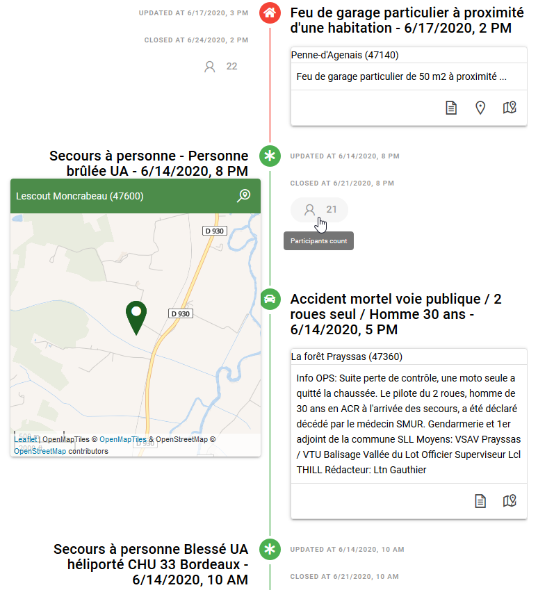
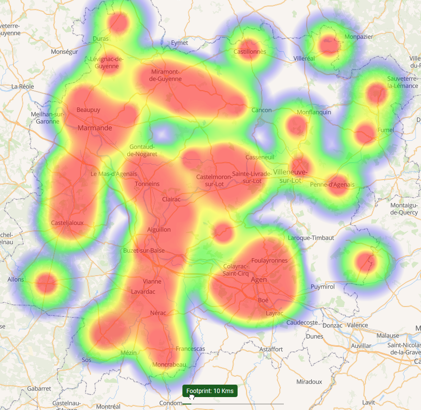
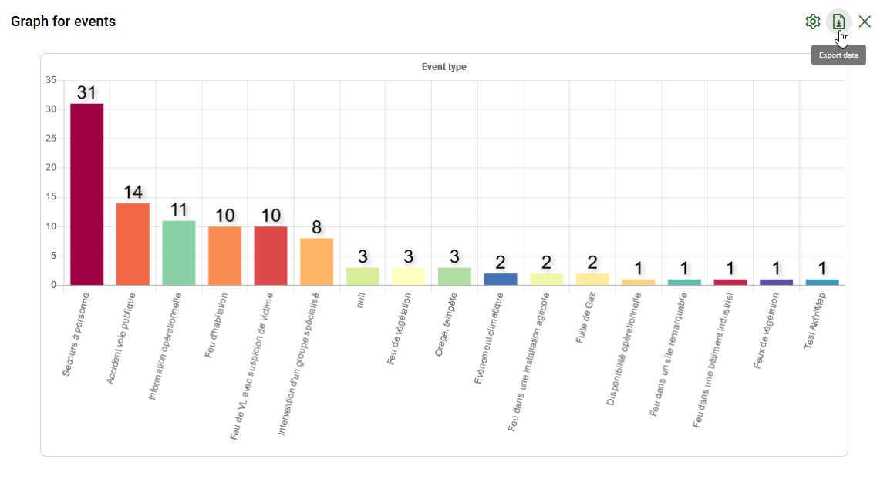

# Logbook

The **logbook** is a long-term archive of your [events](../quickstart/concepts.md#event). It offers a complete traceability of your events with relevant statistics through charts or maps.

::: warning Note
This feature requires a specific subscription, it will not be available otherwise.

:point_right: You own an organisation ? <tour-link text="How to subscribe" path="home" :params="{ organisation: 'owner', route: 'organisation-settings-activity', page: 'billing' }"/>
:::

The default view in this activity is a **timeline** or **history** displaying all events sequentially in a given time range. In addition to usual events actions you will find there some information related to traceability like event creation/update/closing dates and participant count:

::: danger
Once archived, data generated by the application are anonymized by suppressing personally identifiable information like names in order to limit your liability with respect to [GDPR](https://en.wikipedia.org/wiki/General_Data_Protection_Regulation), but also as a privacy protection.

However, the content entered by your members is stored "as-is". As a consequence, you must ensure it complies GDPR.
:::

You can switch to a cartographic view of your events to locate it accurately:

Or display a heatmap to study its spatial distribution:

Last but not least, you will be able to produce statistics about your events and export the data to third-party application like Microsoft® Excel®:

:point_right: You manage an organisation ? <tour-link text="Browse your event archive" path="home" :params="{ organisation: 'manager', route: 'archived-events-activity' }"/>

::: details See also
How to enter the archived events activity from the <tour-link text="dashboard" path="home/organisations"/>

How to display the dashboard from the <tour-link text="main menu" path="home" :params="{ tour: 'home' }"/>
:::

